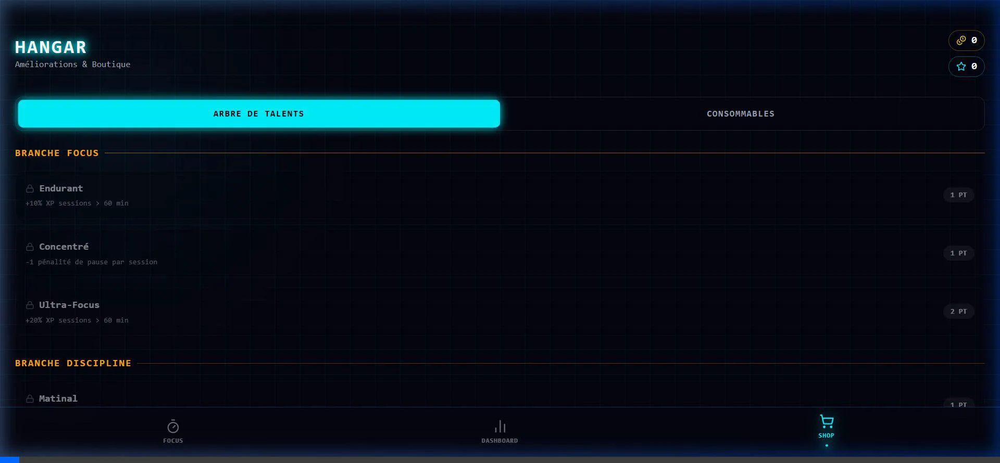

# 🌌 FocusGrind.sys - L'Élite de la Productivité Cyberpunk

[](https://nextjs.org/)
[](https://supabase.com/)
[](LICENSE)

> *"La distraction est une erreur système. Le Focus est le correctif."*

**FocusGrind** est un système d'exploitation conçu pour hacker votre propre discipline. Fusionnant science de la concentration et gamification RPG, il transforme votre temps de travail en une ascension épique dans la Grille.

---

## 📸 Immersion Visuelle

<div align="center">
  
</div>

<div align="center">
  
  
</div>

---

## 💎 Les Piliers du Protocole

### 📶 Zéro Latence : Offline-First & Synchro Cloud
Dans la Grille, la connexion est secondaire. FocusGrind utilise **Dexie.js** pour une persistance locale immédiate.
- **Continuité Totale** : Travaillez n'importe où, vos données sont écrites instantanément sur votre appareil.
- **Réconciliation Intelligente** : Un moteur de synchronisation asynchrone fusionne vos progrès avec **Supabase** dès que le signal revient.
- **PWA Native** : Installez l'interface directement sur votre écran d'accueil pour un accès instantané et un support hors-ligne total.

### ⚔️ Mécaniques RPG & Gamification
- **Évolution & Stats** : Gagnez de l'XP pour monter de niveau. Chaque niveau renforce votre identité de Cyber-Héros.
- **Modes de Combat (Focus)** : Choisissez votre technique de concentration :
    - **Pomodoro** (20/5) : Pour les tâches fragmentables.
    - **Deep Work** (90 min) : Pour une immersion totale.
    - **Sprint** (15 min) : Pour une explosion de productivité.
    - **Flow** : Chronomètre libre pour les sessions infinies.
- **Berserker Mode (XP x2)** : Un mode de haut risque. Activez-le pour doubler vos gains d'XP, mais attention : une interruption vous coûtera cher en réputation.
- **Arbre de Talents Stratégique** : Personnalisez votre style :
    - **Discipline du Matin** : Bonus d'XP pour les sessions avant 9h.
    - **Spécialiste Focus** : Augmente les gains sur les longues sessions.
    - **Résilience** : Réduit les pénalités d'abandon.

### 🐙 Raid de Boss & Économie
- **Le Kraken** : Le boss de la semaine se nourrit de votre distraction. Chaque minute de focus communautaire lui assène un coup. Participez à son élimination pour des récompenses massives.
- **Boutique Cyber** : Utilisez vos **Pomocoins** durement gagnés pour acheter des **Boucliers de Streak** ou des **Resets de Talents**.

---

## 🛠️ Excellence Technique (The Registry)

FocusGrind n'est pas qu'une UI néon, c'est une prouesse d'optimisation :

- **Économie de Batterie (Wake Lock)** : Utilisation de l'API `navigator.wakeLock` pour empêcher votre écran de s'éteindre durant vos sessions de survie.
- **Notifications Système** : Alertes natives pour vous prévenir de la fin d'un cycle, même si l'onglet est masqué.
- **Protocole Anti-Distraction** : Une détection de visibilité met automatiquement votre session en pause si vous quittez l'application trop longtemps.
- **Animations 60 FPS** : Architecture Framer Motion optimisée pour une expérience fluide même sur mobile.

---

## 🚀 Initialisation de la Grille

```bash
# Activation du protocole
git clone https://github.com/NguetchuissiBrunel/Pre_Hackverse_UBUNTU.git
npm install
npm run dev
```

---

<div align="center">
  <h3>Rejoignez la Division FocusGrind</h3>
  <p><i>Propulsé par la volonté, forgé dans la concentration.</i></p>
  
</div>
