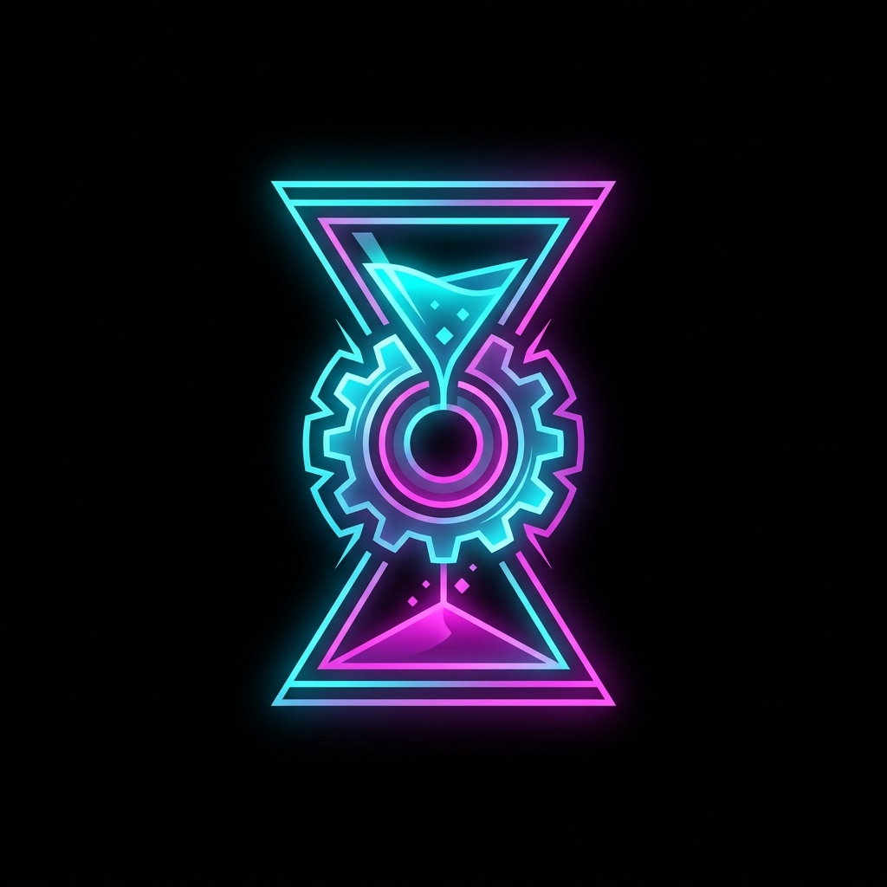
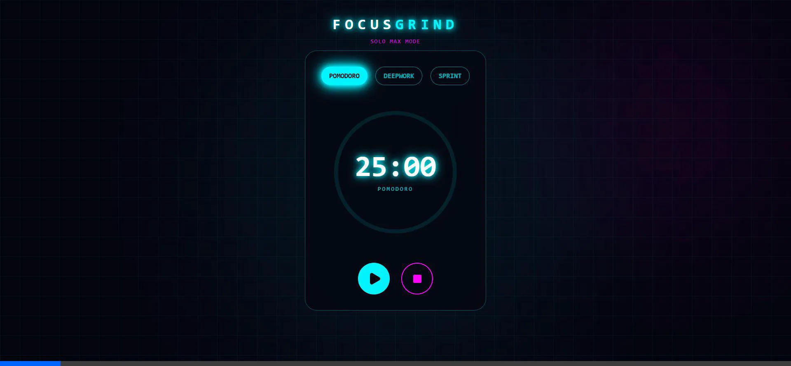
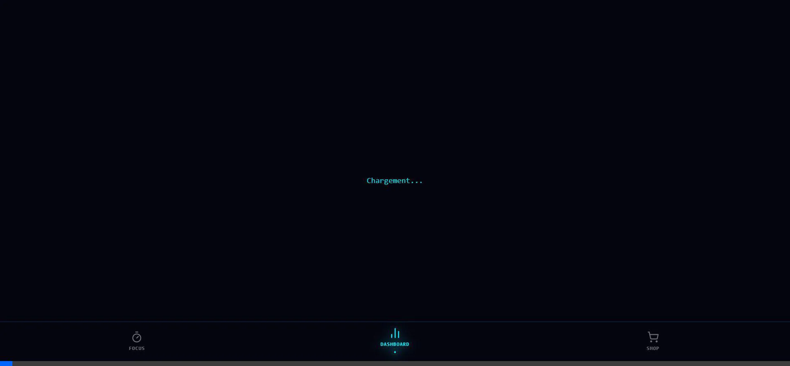
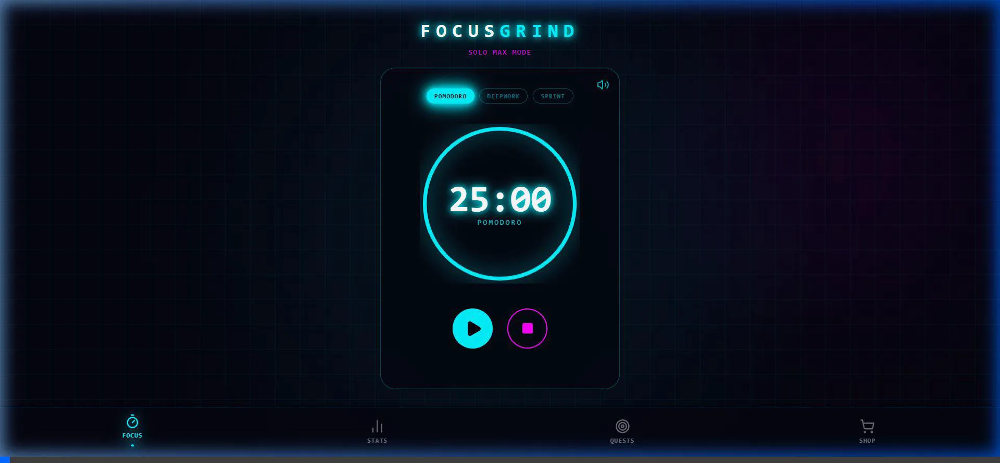

# 🌌 FocusGrind.sys - L'Élite de la Productivité Cyberpunk

[](https://nextjs.org/)
[](https://supabase.com/)
[](https://web.dev/progressive-web-apps/)

> *"La distraction est une erreur système. Le Focus est le correctif."*

**FocusGrind** n'est pas une énième application de productivité. C'est un **système d'exploitation pour votre discipline**. Conçu pour les "Cyber-Héros" de l'ère moderne, il fusionne une gestion du temps de haut niveau avec une profondeur RPG digne des plus grands jeux cyberpunk.

---

## 📸 Immersion Visuelle

<div align="center">
  
</div>

<div align="center">
  
  
</div>

---

## 💎 Les Piliers du Protocole

### 📶 Le Pouvoir de l'Indépendance : Offline-First
Dans la Grille, la connexion internet est un luxe, pas une nécessité. **FocusGrind** est bâti sur une architecture **Offline-First** radicale utilisant **Dexie.js**.
- **Zéro Latence** : Chaque milliseconde de votre focus est enregistrée instantanément sur votre appareil.
- **Continuité Totale** : Travaillez dans le métro, en avion ou dans une zone d'ombre numérique. L'application ne vous fera jamais défaut.
- **Soumission Locale** : Vos sessions, vos gains d'XP et vos achats sont persistants localement dès que vous cliquez.

### 🔄 La Grille de Synchronisation (Cloud Sync)
Dès que votre appareil détecte un signal, le protocole de synchronisation s'active discrètement en arrière-plan.
- **Réconciliation Intelligente** : Notre moteur asynchrone fusionne vos sessions hors-ligne avec votre profil **Supabase**.
- **Multi-Appareils** : Commencez votre focus sur mobile, retrouvez vos statistiques sur desktop.
- **Sécurité Militaire** : Vos données sont protégées par les protocoles d'authentification de Supabase, garantissant que votre progression est éternelle.

### ⚔️ Gamification : Plus qu'une App, un RPG
Nous avons transformé la discipline en aventure. Le "Grind" n'est plus une corvée, c'est une ascension.
- **Évolution de l'Avatar** : Gagnez de l'XP pour monter de niveau. Chaque niveau est une preuve de votre ténacité.
- **Arbre de Talents Stratégique** : Dépensez vos points pour débloquer des bonus passifs (Gain d'XP x2 le matin, Bouclier anti-pénalité, etc.).
- **Raid de Boss Hebdomadaire** : Chaque jour, la communauté combat le **Kraken**. Vos minutes de focus sont les coups d'épée qui infligent des dégâts au boss.
- **Penalty Box™** : Un système qui punit l'abandon mais récompense la persévérance. Brisez votre série de focus et vous devrez faire face aux conséquences de la "Grille".

### 🎒 Économie et Inventaire
Accumulez des **Pomocoins** et dépensez-les dans une boutique cyberpunk.
- **Boucliers de Streak** : Protégez votre progression même quand la vie vous oblige à une pause.
- **Consommables** : Reset de talents, boosts temporaires, personnalisez votre expérience de combat.

---

## 🛠️ Spécifications Techniques (The Registry)

FocusGrind repousse les limites des technologies web modernes pour offrir une expérience "Native-Like" :

- **Moteur UI** : Framer Motion pour des transitions fluides à 60 FPS et des effets néon immersifs.
- **Persistance** : IndexedDB via Dexie pour une gestion de base de données locale ultra-rapide.
- **Backend-as-a-Service** : Supabase pour l'Auth, la synchronisation temps réel et la sécurité.
- **PWA Ready** : Support du Service Worker pour une installation complète et un usage hors-ligne total.

---

## 🚀 Initialisation

```bash
# Activation de la Grille
git clone https://github.com/NguetchuissiBrunel/Pre_Hackverse_UBUNTU.git
npm install
npm run dev
```

---

<div align="center">
  <h3>Rejoignez la Division FocusGrind</h3>
  <p><i>Propulsé par la volonté, forgé dans la concentration.</i></p>
  
</div>
